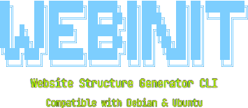

<h1 align="center">Web Structure Generator</h1>

<p align="center">
  
</p>

<p align="center">
  
  
  
  <br>
  
  
  
</p>

<p align="center">
  <b>Website Structure Generator CLI Tool</b><br>
  <i>10 templates for scaffolding web projects, with Git support and auto-chmod permissions.</i>
</p>

<p align="center">
  
  
  
  
</p>

---

## 📦 Installation

### Quick Install (recommended)

```bash
git clone https://github.com/jindrichstoklasa/web-structure-generator.git
cd web-structure-generator
chmod +x install.sh
sudo ./install.sh
```

### Manual Install

```bash
git clone https://github.com/jindrichstoklasa/web-structure-generator.git
cd web-structure-generator
chmod +x webinit
sudo cp webinit /usr/local/bin/webinit
```

### Uninstall

```bash
sudo rm /usr/local/bin/webinit
```

---

## 🚀 Usage

```bash
webinit <site-name> [options]
webinit <command>
```

Run `webinit help` to see all available commands and options.

---

## 📋 Commands

### 🖥️ Basic Commands

| Command | Description |
|---------|-------------|
| `webinit <site-name>` | Create a new project with the default structure |
| `webinit templates` | List all available templates with their folder structures |
| `webinit help` | Display the full help message with all commands and options |
| `webinit version` | Display the current installed version |

### ⚙️ Options

| Option | Description |
|--------|-------------|
| `--template <name>` | Use a specific template for the project structure |
| `--git` | Initialize a Git repository in the project directory |
| `--gitignore` | Create a `.gitignore` file with common ignore rules |
| `--serve` | Start a PHP development server after project creation |
| `--port <number>` | Set a custom port for `--serve` (default: `8000`) |
| `--force` | Overwrite an existing directory with the same name |
| `--open` | Open the project in VS Code after creation |
| `--no-css` | Remove all CSS directories, stylesheets, and `<link>` tags |
| `--no-js` | Remove frontend JS directories, scripts, and `<script>` tags |

> **Note on `--no-js`:** Removes all `js/` directories (including nested ones like `public/js/`), `src/` (for SPA templates), and frontend `.js` files. Server-side files are preserved — `server.js`, `routes/`, `controllers/`, `models/`, `middleware/`, and `config/` remain untouched.

> **Note on `--no-css`:** Removes all `css/` directories (including nested ones like `public/css/`) and all `.css` files. Also strips `<link>` stylesheet tags from HTML, EJS, and PHP files.

---

## 📄 Templates

### 1. `landing-page` — Marketing / Landing Page

Best for product launches, marketing campaigns, and single-page sites.

```
site-name/
├── index.html
├── css/
│   ├── style.css
│   └── responsive.css
├── js/
│   ├── main.js
│   └── animations.js
├── sections/
└── assets/
    ├── img/
    ├── fonts/
    └── icons/
```

### 2. `blog` — Personal Blog

Best for personal blogs, article sites, and journals.

```
site-name/
├── index.html
├── post.html
├── about.html
├── css/
│   └── style.css
├── js/
│   └── main.js
└── assets/
    └── img/
```

### 3. `portfolio` — Personal Portfolio

Best for developer portfolios and creative showcases.

```
site-name/
├── index.html
├── css/
│   ├── style.css
│   └── responsive.css
├── js/
│   └── main.js
├── projects/
└── assets/
    └── img/
        ├── projects/
        └── profile/
```

### 4. `webapp` — Vanilla SPA (Single-Page Application)

Best for interactive web apps, dashboards, and browser-based tools.

```
site-name/
├── index.html
├── src/
│   ├── app.js
│   ├── router.js
│   └── views/
│       ├── home.js
│       └── about.js
├── css/
│   └── style.css
└── assets/
    └── img/
```

### 5. `ecommerce` — E-Commerce Storefront

Best for online shops and product catalogs.

```
site-name/
├── index.html
├── pages/
│   ├── products.html
│   └── cart.html
├── css/
│   ├── style.css
│   └── shop.css
├── js/
│   ├── main.js
│   └── cart.js
├── components/
└── assets/
    ├── img/
    │   └── products/
    └── icons/
```

### 6. `fullstack-node` — Node.js + Frontend (Express + EJS)

Best for full-stack web apps and server-rendered sites.

```
site-name/
├── server.js
├── package.json
├── .env.example
├── public/
│   ├── index.html
│   ├── css/style.css
│   └── js/main.js
├── routes/
│   ├── index.js
│   └── api.js
├── views/
│   ├── index.ejs
│   └── partials/
│       ├── header.ejs
│       └── footer.ejs
└── assets/
    └── img/
```

### 7. `php-classic` — Classic PHP Application

Best for traditional PHP sites and LAMP stack projects.

```
site-name/
├── public/
│   ├── index.php
│   └── .htaccess
├── includes/
│   ├── db.php
│   └── functions.php
├── templates/
│   ├── header.php
│   └── footer.php
├── config/
│   └── config.php
└── logs/
```

### 8. `dashboard` — Admin Dashboard / Control Panel

Best for admin panels, analytics dashboards, and CMS backends.

```
site-name/
├── index.html
├── css/
│   ├── style.css
│   └── dashboard.css
├── js/
│   ├── main.js
│   └── charts.js
├── components/
├── data/
│   └── sample.json
└── assets/
    ├── img/
    └── icons/
```

### 9. `api-rest` — REST API Backend (Node.js + Express)

Best for backend APIs and microservices.

```
site-name/
├── server.js
├── package.json
├── .env.example
├── routes/
│   └── api.js
├── controllers/
│   └── exampleController.js
├── models/
│   └── exampleModel.js
├── middleware/
│   └── auth.js
├── config/
│   └── db.js
└── tests/
    └── api.test.js
```

### 10. `docs` — Documentation Site

Best for project documentation, guides, and wikis.

```
site-name/
├── index.html
├── css/
│   └── style.css
├── js/
│   └── main.js
├── docs/
│   ├── getting-started.md
│   └── installation.md
└── assets/
    └── img/
```

---

## 💻 Compatibility

| Distribution | Version | Status |
|-------------|---------|--------|
| **Ubuntu** | 20.04+ | ✅ Fully supported |
| **Ubuntu** | 22.04+ | ✅ Fully supported |
| **Ubuntu** | 24.04+ | ✅ Fully supported |
| **Debian** | 11 (Bullseye) | ✅ Fully supported |
| **Debian** | 12 (Bookworm) | ✅ Fully supported |

---

## 📖 Examples

```bash
# Create a basic website structure
webinit my-site

# Create a blog project using the blog template
webinit my-blog --template blog

# Create a portfolio with Git initialized and a .gitignore
webinit my-portfolio --template portfolio --git --gitignore

# Create a project and immediately start a dev server on port 3000
webinit my-app --serve --port 3000

# Overwrite an existing project and open it in VS Code
webinit my-site --force --open

# Create a minimal project with no CSS and no JS
webinit my-page --no-css --no-js

# Create a full-stack Node.js project with all extras
webinit my-app --template fullstack-node --git --gitignore --open
```

---

## 📄 License

This project is licensed under the MIT License — see the [LICENSE](LICENSE) file for details.

---

<p align="center">
  Made with ❤️ for the Linux community
</p>
